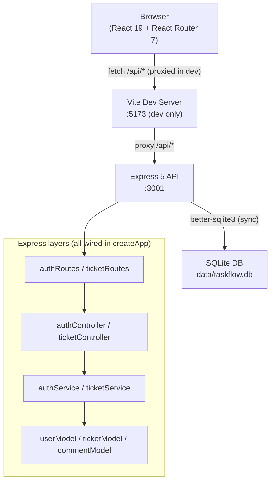

# TaskFlow — Developer Onboarding Guide

This guide is written for a developer joining the existing production maintenance squad. It is based on a direct reading of the source code, tests, schema, and configuration. Where the existing documentation differs from the implementation, this document notes the discrepancy.

---

## 1. What TaskFlow Does and Who Uses It

TaskFlow is an internal IT maintenance-request tracker. Staff create tickets to report application problems, track who is handling them, and leave work notes as comments. There is no customer-facing component.

**Roles defined in the database schema:** `Analyst`, `Developer`, `Manager`.

Ticket permissions are role-based. Analysts create and triage requests through `IN_PROGRESS`; Developers claim unassigned work or update their own tickets through `RESOLVED`; Managers have full ticket access and are the only role that can close tickets or issue password-reset tokens. Every authenticated role can read tickets and add comments. The service layer is authoritative; frontend permission helpers only keep the interface consistent with it.

---

## 2. Technology Stack

| Layer | Technology |
|---|---|
| Runtime | Node.js ≥ 20 (ESM, `"type": "module"`) |
| Frontend | React 19, React Router 7, Vite 7 |
| Backend | Express 5 |
| Database | SQLite via `better-sqlite3` (synchronous API) |
| Auth | bcryptjs for password hashing; opaque tokens in a server-side `Map` |
| Tests | Node.js built-in test runner + supertest |
| Dev runner | `concurrently` (API on :3001, Vite dev server on :5173) |

No TypeScript, no linter config, no formatter config. Match the style of existing files (2-space indent, single quotes, no trailing semicolons unless surrounding code already has them).

---

## 3. High-Level Architecture



In production (`NODE_ENV=production`) the Express process serves the built `dist/` folder directly and there is no Vite server. All `/api` calls go to the same process, and all non-`/api` routes return `index.html` (SPA fallback).

---

## 4. Dependency Injection Pattern

Everything follows a **factory + DI** pattern. Nothing is a singleton; nothing imports the database directly.

```
createDatabase(filename)
  └─ createUserModel(db)
  └─ createTicketModel(db)
  └─ createCommentModel(db)
       └─ createAuthService(userModel)
       └─ createTicketService(ticketModel, commentModel, userModel)
            └─ createAuthController(authService)
            └─ createTicketController(ticketService)
                 └─ authRoutes(controller, authMiddleware)
                 └─ ticketRoutes(controller)
                      └─ createApp(db, options)   ← single composition root
```

[`server/app.js`](../server/app.js) is the **only** composition root. Tests call `createApp(':memory:')` to get a fully isolated server without touching the production database.

---

## 5. Frontend Components and Pages

### Routing ([`src/App.jsx`](../src/App.jsx))

All routes are wrapped in [`Layout`](../src/components/Layout.jsx) (top bar + side nav) and gated by the [`AuthContext`](../src/context/AuthContext.jsx). If `user` is null the entire app shows only `LoginPage`.

| Route | Component | Purpose |
|---|---|---|
| `/dashboard` | `DashboardPage` | Status-count cards + 5 most-recently-updated tickets |
| `/tickets` | `TicketsPage` | Filterable/searchable ticket list |
| `/tickets/new` | `TicketFormPage` | Create ticket |
| `/tickets/:id` | `TicketDetailPage` | Full ticket view with inline comment form |
| `/tickets/:id/edit` | `TicketFormPage` | Edit ticket (same component, `editing = Boolean(id)`) |
| `/users` | `UsersPage` | Read-only user list |
| `*` | — | Redirects to `/dashboard` |

### Shared Components

| File | Export | Purpose |
|---|---|---|
| [`src/components/Layout.jsx`](../src/components/Layout.jsx) | `Layout` | App shell (top bar, side nav, `<Outlet>`) |
| [`src/components/PageState.jsx`](../src/components/PageState.jsx) | `LoadingState`, `ErrorState` | Standard loading/error states — use instead of inline markup |
| [`src/components/StatusBadge.jsx`](../src/components/StatusBadge.jsx) | `StatusBadge`, `statusLabels` | Coloured badge; CSS class follows `status-${status.toLowerCase()}` |

### API Client ([`src/api.js`](../src/api.js))

Single `api(path, options)` function. Reads the token from `localStorage` key `taskflow_token` and injects `Authorization: Bearer <token>` on every call. Throws on non-2xx responses with `body.error` as the message. Returns `null` for HTTP 204.

### Auth State ([`src/context/AuthContext.jsx`](../src/context/AuthContext.jsx))

On mount, `AuthProvider` checks `localStorage` for an existing token and validates it against `GET /api/auth/me`. If the token is invalid/expired the item is removed from `localStorage` and the user is sent to the login screen. `login()` stores the returned token; `logout()` calls the server and clears local storage.

---

## 6. Backend Layers and Responsibilities

### Models (`server/models/`)

Pure database access — **synchronous, no async/await**. Each factory receives `db` and returns an object of query functions. Responsibilities: SQL generation, column selection, and JOIN resolution. No validation here.

| Model | Key behaviour |
|---|---|
| [`userModel`](../server/models/userModel.js) | `findByEmail` only returns `active = 1` users. `findById` and `list()` **never** return `password_hash` — public fields are hardcoded. |
| [`ticketModel`](../server/models/ticketModel.js) | `list()` accepts `{ search, status }`. Search matches title, description, or owner name (case-insensitive LIKE). Results ordered `updated_at DESC, id DESC`. |
| [`commentModel`](../server/models/commentModel.js) | `create()` also updates `tickets.updated_at` in the same call so the ticket surfaces in recent-activity lists. |

### Services (`server/services/`)

Business logic and validation. Throw errors using `Object.assign(new Error('msg'), { status: N })` so the global error handler in `app.js` can map them to the correct HTTP status code.

| Service | Key behaviour |
|---|---|
| [`authService`](../server/services/authService.js) | Session store is a plain `Map` inside the closure — **in-memory only**. Generates a 32-byte hex token via `crypto.randomBytes`. Restarting the server invalidates all sessions. |
| [`ticketService`](../server/services/ticketService.js) | Exports `STATUSES = ['OPEN', 'IN_PROGRESS', 'RESOLVED', 'CLOSED']`. Validates title, description, status, and owner existence on create and update. Default status on create is `'OPEN'` if not provided. |

### Controllers (`server/controllers/`)

Thin HTTP adapters — read from `req`, call a service method, and write to `res`. No business logic or validation here.

- `created.status(201)` for create and addComment; `200` for all other success responses.
- `204` for logout.

### Middleware ([`server/middleware/auth.js`](../server/middleware/auth.js))

`requireAuth(authService)` extracts the Bearer token from the `Authorization` header, looks it up in the session map, and either attaches `req.user` + `req.token` and calls `next()`, or responds `401`.

### Routes (`server/routes/`)

Map HTTP verbs and paths to controller methods. The auth middleware is applied per-route in `authRoutes` and globally for all of `/api/tickets` in `app.js`.

### Entry Point (`server/index.js`)

Calls `createDatabase()` → `seedDatabase(db)` → `createApp(db, { serveClient: ... })` → `app.listen()`. Registers `SIGINT`/`SIGTERM` handlers for graceful shutdown.

---

## 7. REST API Reference

Base path: `/api`. All endpoints except `GET /api/health` and `POST /api/auth/login` require `Authorization: Bearer <token>`.

All success responses wrap their payload in a named key (`ticket`, `tickets`, `user`, `users`, `comment`, `counts`). Errors use `{ "error": "message" }`.

### Auth

| Method | Path | Auth | Request body | Response |
|---|---|---|---|---|
| `POST` | `/api/auth/login` | — | `{ email, password }` | `{ token, user }` |
| `GET` | `/api/auth/me` | ✓ | — | `{ user }` |
| `POST` | `/api/auth/logout` | ✓ | — | `204` |

### Tickets

| Method | Path | Auth | Notes |
|---|---|---|---|
| `GET` | `/api/tickets` | ✓ | `?search=&status=` query params |
| `POST` | `/api/tickets` | ✓ | `creator` is set to `req.user.id` |
| `GET` | `/api/tickets/:id` | ✓ | Includes `comments` array |
| `PUT` | `/api/tickets/:id` | ✓ | Full replace of editable fields |
| `POST` | `/api/tickets/:id/comments` | ✓ | `{ content }` |

### Other

| Method | Path | Auth | Notes |
|---|---|---|---|
| `GET` | `/api/health` | — | Returns `{ status: "ok" }` |
| `GET` | `/api/dashboard` | ✓ | Returns `{ counts: { OPEN, IN_PROGRESS, RESOLVED, CLOSED } }` |
| `GET` | `/api/users` | ✓ | All users ordered by name; no `password_hash` |

---

## 8. Database Entities and Relationships

Schema evolution lives in numbered SQL files under [`server/database/migrations/`](../server/database/migrations/). `migrationRunner.js` applies pending files transactionally on startup and records them in `schema_migrations`.

```
users
  id (PK)
  name
  email (UNIQUE)
  password_hash
  role          CHECK IN ('Analyst', 'Developer', 'Manager')
  active        DEFAULT 1
  created_at

tickets
  id (PK)
  title
  description
  status        CHECK IN ('OPEN', 'IN_PROGRESS', 'RESOLVED', 'CLOSED')  DEFAULT 'OPEN'
  owner_id      FK → users.id  ON DELETE SET NULL  (nullable)
  created_by_id FK → users.id  (NOT NULL)
  created_at
  updated_at

comments
  id (PK)
  ticket_id     FK → tickets.id  ON DELETE CASCADE
  author_id     FK → users.id    (NOT NULL)
  content
  created_at
```

**Indexes:** `tickets.status`, `tickets.owner_id`, `comments.ticket_id`.

**WAL mode** is enabled on every open.

Dates are stored as `TEXT` in UTC (SQLite `CURRENT_TIMESTAMP` format: `YYYY-MM-DD HH:MM:SS`). The frontend normalises them before passing to `Intl.DateTimeFormat`:

```js
value.includes('T') ? value : `${value.replace(' ', 'T')}Z`
```

---

## 9. Authentication and Session Behaviour

1. Client sends `POST /api/auth/login` with `{ email, password }`.
2. `authService.login()` looks up the user by email (active users only), verifies the bcrypt hash, generates a 32-byte random hex token, stores `{ token → publicUser }` in a `Map`, and returns `{ token, user }`.
3. Client stores the token in `localStorage` under `taskflow_token`.
4. Every subsequent request includes `Authorization: Bearer <token>`.
5. `requireAuth` middleware looks the token up in the `Map` and attaches `req.user`.
6. `POST /api/auth/logout` calls `sessions.delete(token)` and returns `204`.

**Critical behaviour:** The session `Map` lives in process memory. **Restarting or crashing the API logs everyone out.** Token lookup is an O(1) map lookup — there is no expiry, no sliding window, and no persistence. A valid token remains valid indefinitely until the server restarts or the user explicitly logs out.

**Login only queries active users** (`AND active = 1`). Inactive users exist in the database but cannot log in.

---

## 10. How a Ticket Flows Through the System

```
User → POST /api/tickets
         │
         ▼
ticketController.create(req, res)
  └─ ticketService.create(body, req.user.id)
       ├─ trim fields
       ├─ validateFields() → throws 400 if title/description blank,
       │                     invalid status, or unknown owner_id
       └─ ticketModel.create({ ...values, createdById: userId })
            └─ INSERT INTO tickets …
            └─ returns ticketModel.findById(lastInsertRowid)
                 (full row with owner + creator names via JOIN)

User → PUT /api/tickets/:id
  └─ ticketService.update(id, body)
       ├─ ticketModel.findById(id) → 404 if missing
       ├─ validateFields()
       └─ ticketModel.update(id, values)
            └─ UPDATE … SET updated_at = CURRENT_TIMESTAMP

User → POST /api/tickets/:id/comments
  └─ ticketService.addComment(id, content, req.user.id)
       ├─ ticketModel.findById(id) → 404 if missing
       ├─ validates content not blank
       └─ commentModel.create({ ticketId, authorId, content })
            ├─ INSERT INTO comments …
            └─ UPDATE tickets SET updated_at = CURRENT_TIMESTAMP
```

Adding a comment bumps `tickets.updated_at`, which is why commented tickets appear near the top of the list and dashboard "recently updated" section.

**There is no status machine.** Any status can transition to any other status directly — a `CLOSED` ticket can be set back to `OPEN` with a single PUT.

---

## 11. Running and Testing the Application Locally

### Prerequisites

- Node.js 20 or newer
- npm

### Setup

```bash
npm install
npm run setup        # creates data/taskflow.db and seeds 5 users + 12 tickets
npm run dev          # API on :3001, Vite dev server on :5173
```

Open [http://localhost:5173](http://localhost:5173). All five seed users share the password `taskflow123`.

| Name | Email | Role |
|---|---|---|
| Maria Santos | maria.santos@taskflow.local | Analyst |
| Daniel Costa | daniel.costa@taskflow.local | Developer |
| Priya Nair | priya.nair@taskflow.local | Developer |
| Robert Chen | robert.chen@taskflow.local | Manager |
| Elena Rossi | elena.rossi@taskflow.local | Analyst |

### Environment Variables

| Variable | Default | Purpose |
|---|---|---|
| `API_PORT` | `3001` | API port (dev and prod; also used by the Vite proxy) |
| `PORT` | `3001` | Production API port (checked after `API_PORT`) |
| `DATABASE_PATH` | `data/taskflow.db` | Path to the SQLite file |

### Running Tests

```bash
npm test
# or filter by name:
node --test --test-concurrency=1 --test-name-pattern="adds a comment" server/tests/*.test.js
```

Tests use an in-memory database seeded fresh per run. The `--test-concurrency=1` flag is **required** — tests share module-level state (`token`, `app`) and must run serially.

**Test-coupled counts:** The test for `lists, searches, and filters tickets` asserts exactly 12 tickets; `returns dashboard counts and users` asserts the sum of all status counts equals 13 (12 seed tickets + 1 created by an earlier test). If you add seed data, update those assertions in [`server/tests/api.test.js`](../server/tests/api.test.js).

### Production Build

```bash
npm run build
NODE_ENV=production npm start
```

The API and the built frontend are served on port 3001 (or `PORT`). The static files are served from `dist/` and the SPA fallback catches all non-`/api` routes.

---

## 12. Implementation Conventions

These are non-obvious rules observed in the codebase. Violating them will break tests or runtime behaviour.

1. **No `async/await` in model files.** `better-sqlite3` is synchronous. Using `async` in a model returns a resolved `Promise`, not the query result, which silently breaks callers.

2. **Never import `db` directly** outside of `server/database/`. Always pass it through the factory chain.

3. **Throw errors with a `status` property** for expected HTTP error responses:
   ```js
   throw Object.assign(new Error('Not found.'), { status: 404 })
   ```
   The global error handler reads `.status`; errors without it (or with `status >= 500`) are logged and return `"Unexpected server error."` to the client.

4. **Explicit file extensions on all imports** (`.js`, `.jsx`). ESM does not resolve bare extensions.

5. **`userModel.list()` and `findById()` never return `password_hash`.** The public field list is hardcoded. Do not use `SELECT *` in any query that returns users.

6. **`StatusBadge` CSS classes** follow `status-${status.toLowerCase()}`. The existing values are `status-open`, `status-in_progress`, `status-resolved`, `status-closed`. Adding a new status requires a matching CSS rule in [`src/styles.css`](../src/styles.css).

7. **Ticket ID display format:** `TF-${String(id).padStart(4, '0')}` (e.g. `TF-0001`). This is purely cosmetic — the actual database ID is used in all API paths.

8. **`formatDate()` is exported from `DashboardPage.jsx`** and imported by `TicketsPage.jsx` and `TicketDetailPage.jsx`. It is a utility function that normalises SQLite text dates to ISO format before parsing.

9. **`seedDatabase` is idempotent** — it checks if the users table is non-empty and returns early if so. Running `npm run setup` multiple times is safe.

10. **Test concurrency must be 1.** There is no per-test isolation; all tests share the same in-memory DB instance and the same authenticated token.

---

## 13. Known Architectural Limitations and Technical Risks

| Area | Risk |
|---|---|
| **In-memory sessions** | The session `Map` is lost on every server restart or process crash. All users are logged out. Not suitable for rolling restarts, load-balanced deployments, or multi-process setups. |
| **No token expiry** | A token is valid indefinitely until the server restarts or the user explicitly logs out. A stolen token grants permanent access. |
| **RBAC policy duplicated in UI and service** | The backend is authoritative, but `src/permissions.js` mirrors rules for presentation. Update both and extend API tests whenever the role matrix changes. |
| **No request-level rate limiting or brute-force protection** | `POST /api/auth/login` has no lockout mechanism. |
| **SQLite single-writer constraint** | WAL mode allows concurrent reads, but write operations are serialised. Under significant concurrent write load this will become a bottleneck. |
| **No pagination on ticket list** | `GET /api/tickets` returns all matching rows. As the ticket count grows this will become slow and memory-heavy. |
| **`created_by_id` is immutable by convention only** | The schema does not prevent `UPDATE tickets SET created_by_id = ...`. The service layer does not expose this field on update, but there is no DB-level constraint. |
| **Seed data coupled to test assertions** | Exact record counts (12 tickets, 5 users, 13 dashboard total) are hardcoded in the test file. Adding seed records without updating the tests will cause test failures. |
| **Forward-only migrations** | Migration history is recorded and additive changes are automatic. There are no down migrations; recover destructive changes from a verified backup or add a corrective forward migration. |
| **Migration discipline required** | Never edit an applied migration. Add a new numbered migration and validate it against both an empty and an existing database. |

---

## 14. Documentation Gaps, Ambiguities, and Inconsistencies

These were found by comparing [`docs/api.md`](api.md) and [`docs/overview.md`](overview.md) against the source code.

### `docs/api.md`

- **`GET /api/users` described as "active and inactive users"** — the source code (`userModel.list()`) returns all users with no `active` filter. This is accurate, but the description "active and inactive users available to the interface" is misleading phrasing. The `findByEmail` method (used by login) *does* filter by `active = 1`, but the list endpoint does not.
- **`PUT /api/tickets/:id` described as "replace editable fields"** — the implementation is a full replacement (all four fields are required). There is no PATCH endpoint. If you omit a field, it will be set to `undefined`, which the service will reject as a validation error. This is not made explicit in the docs.
- **No mention of the `GET /api/health` response shape** — the endpoint exists and returns `{ status: "ok" }` but is not documented.
- **No documentation of the exact fields returned** by `GET /api/tickets/:id` (the `owner`, `created_by` string fields from JOINs are not obvious from the schema alone).

### `docs/overview.md`

- **"SQLite uses WAL mode"** — correct, but the document does not mention that WAL mode is set in `createDatabase()` via `db.pragma('journal_mode = WAL')`, not in the schema file.
- **"Login sessions are deliberately simple and kept in server memory"** — accurate, but the document does not mention the consequence: **no token expiry and no persistence across restarts**.
- **The `server/scripts/` directory is not mentioned** in the structure description.

### `README.md`

- The README correctly documents all five seed users and states `npm run setup` is safe to re-run. No inaccuracies found.
- The README does not mention that `API_PORT` is also read by the Vite proxy (`vite.config.js`), so changing this variable affects both the API port *and* the dev server proxy target.
